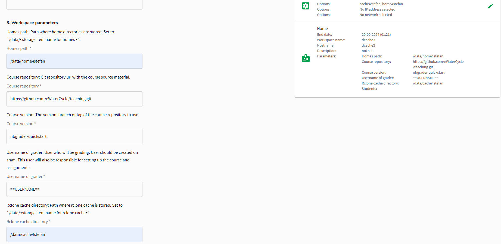

# Instructions for system administrators to deploy the eWaterCycle platform


[](https://doi.org/10.5281/zenodo.1462548)

This repo contains (codified) instructions for deploying the eWaterCycle platform. The target audience of these instructions are system administrators. For more information on the eWaterCycle platform (and how to deploy it) see the [eWaterCycle documentation](https://ewatercycle.readthedocs.io/).

With grading setup is [one class, one grader](https://nbgrader.readthedocs.io/en/stable/configuration/jupyterhub_config.html#example-use-case-one-class-one-grader).

For instructions on how to use the machine as deployed by this repo see the [User guide](USER.md).

These instructions assume you have some basic knowledge of [vagrant](https://vagrantup.com) and
[Ansible](https://docs.ansible.com/ansible/latest/index.html).

## Setup of eWaterCycle platform on the SURF Research cloud

The hardware environment used by the eWaterCycle platform development team is the [SURF Research Cloud](https://servicedesk.surfsara.nl/wiki/display/WIKI/Research+Cloud+Documentation). Starting a machine on the Surf Research Cloud requires that you have research budget with SURF, for more info see the website of [SURF](https://www.surf.nl/en/research-it/apply-for-access-to-compute-services). Once running, access to the machine can be shared to anyone.

The setup instructions in this repo will create an eWaterCycle application(a sort-of VM template) that when started will create a machine with:****

- Explorer: web visualization of available models / parameter sets combinations and a way to generate Jupyter notebooks
- Jupyter Hub: to interactivly generate forcings and perform experiments on hydrological models using the [eWatercycle Python package](https://ewatercycle.readthedocs.io/)
- ERA5 and ERA-Interim global climate data, which can be used to generate forcings
- Installed models and their example parameter sets

An application on the SURF Research cloud is provisioned by running an Ansible playbook (research-cloud-plugin.yml).

In addition to the standard VM storage, additional read-only datasets are mounted at `/data/shared` from a file server. They may contain things like:

- climate data, see <https://ewatercycle.readthedocs.io/en/latest/system_setup.html#download-climate-data>
- observation
- parameter-sets
- singularity-images of hydrological models wrapped in grpc4bmi servers

Previously the eWatercycle platform consisted of multiple VM on SURF HPC cloud, see [v0.1.2 release](https://github.com/eWaterCycle/infra/releases/tag/v0.1.2) for that code.

## Setup of eWaterCycle platform on a local test VM

Deploying a local test VM is mostly useful for developing the SURF Research Cloud applications. This vagrant setup creates a virtual machine with 8Gb memory, 4 virtual cores, and 70Gb storage. This should work on any Linux or Windows machine.

To set up an Explorer/Jupyter server on your local machine with [vagrant](https://vagrantup.com) and
[Ansible](https://docs.ansible.com/ansible/latest/index.html)

Create config file `research-cloud-plugin.vagrant.vars` with

```yaml
---
# Directory where /home should point to
alt_home_location: /data/volume_3
# Vagrant user is instructor
# The students defined below can be used to login as a student
students: 'student1:pw1,student2:pw2'
worker_ip_addresses: []
```

The token can be found in the eWaterCycle password manager.

```shell
vagrant --version
# Vagrant 2.4.1
vagrant up
```

Visit site

```shell
# Get ip of server with
vagrant ssh -c 'ifconfig eth1'
```

Go to `http://<ip of eth1>` and login with `vagrant:vagrant`.

You will get some complaints about unsecure serving, this is OK for local testing and this will not happen on Research Cloud.

### Vagrant File server

The file server can also be tested locally with

```shell
vagrant up fileserver
vagrant ssh
```

And follow the steps in the [File Server](#file-server) section.

### Test on Windows Subsystem for Linux 2

WSL2 users should follow steps on [https://www.vagrantup.com/docs/other/wsl](https://www.vagrantup.com/docs/other/wsl).

Importantly:

- Work on a folder on the windows file system.
- Export VAGRANT_WSL_WINDOWS_ACCESS_USER_HOME_PATH="/mnt/c/.../infra"
- Install [virtualbox_WSL2 vagrant plugin](https://github.com/Karandash8/virtualbox_WSL2)
- Approve the firewall popup

## Catalog item registration

This chapter is dedicated for catalog item developers.

On the Research cloud the [developer](https://servicedesk.surf.nl/wiki/display/WIKI/Appoint+a+CO-member+a+developer) can add an catalog item for other people to use.
The generic steps to do this are documented [here](https://servicedesk.surf.nl/wiki/display/WIKI/Create+your+own+catalog+items).

For eWatercycle component following specialization was done

- Use Ansible playbook as component script type
  - Use `https://github.com/eWaterCycle/infra.git` as repository URL
  - Use `research-cloud-plugin.yml` as script path
  - Use `grader` as tag
  - Select cloud providers:
    - SURF HPC Cloud, with all non-gpu sizes selected
    - SURF HPC Cloud cluster, with all non-gpu sizes selected
- Component parameters, all fixed source type, required and overwitable unless otherwise stated
  - alt_home_location:
    - default: /data/volume_2
    - description: Path where home directories are stored. Set to `/data/<storage item name for homes>`.
  - grader_user:
    - description: User who will be grading. User should be created on sram. This user will also be responsible for setting up the course and assignments.
    - default: ==USERNAME==
      (==USERNAME== which will be replaced by the actual username of the user creating the workspace)   
  - students:
    - default: []
    - description: List of student user name and passwords. Format '<username1>:<password1>,<username2>:<password2>'. Use '' for no students. Use secure passwords as anyone on the internet can access the machine.
  - course_repo:
    - default: https://github.com/eWaterCycle/teaching.git
    - description: Git repository url with the course source material.
  - course_version
    - description: The version, branch or tag of the course repository to use.
    - default: nbgrader-quickstart
  - worker_ip_addresses:
    - source type: Resource
    - default: worker_ip_addresses
    - desciption: Makes addresses of workers available to Ansible playbook. Only used when cloud provider `SURF HPC Cloud cluster` is selected.
  - samba_password:
    - source_type: Co-Secret
    - value: {"key": "samba_password","sensitive": 1}
- Set documentation URL to `https://github.com/eWaterCycle/infra`
- Do not allow every org to use this component.
- Select the organizations (CO) that are allowed to use the component.

For eWatercycle catalog item following specialization was done

- Select the following components:
  1. SRC-OS
  2. SRC-CO
  3. SRC-Nginx
  4. SRC-External plugin
  5. eWatercycle teaching samba
- Set documentation URL to `https://github.com/eWaterCycle/infra`
- Select the organizations (CO) that are allowed to use the catalog item.
- In cloud provider and settings step:
  - Add `SURF HPC Cloud` as cloud provider
    - Set Operating Systems to Ubuntu 22.04
    - Set Sizes to all non-gpu and non-disabled sizes
- In parameter settings step keep all values as is except
  - Set `co_irods` to `false` as we do not use irods
  - Set `co_research_drive` to `false` as we do not use research drive
  - As interactive parameters expose following:
    - alt_home_location:
      - label: Homes path
      - description: Path where home directories are stored. Set to `/data/<storage item name for homes>`.
    - grader_user:
      - label: Username of grader
      - description: User who will be grading. User should be created on sram.
      - default: empty string
    - students
      - label: Students
      - description: List of student user name and passwords. Format '<username1>:<password1>,<username2>:<password2>'. Use '' for no students. Use secure passwords as anyone on the internet can access the machine.
- Set boot disk size to 150Gb,
  as default size will be mostly used by the conda environment and will trigger out of space warnings.
- Set workspace acces button behavior to `Webinterface (https:)`,
  so clicking on `ACCESS` button will open up the eWatercycle experiment explorer web interface

To become root on a VM the user needs to be member of the `src_co_admin` group on [SRAM](https://sram.surf.nl/).
See [docs](https://servicedesk.surf.nl/wiki/display/WIKI/Workspace+roles%3A+Appoint+a+CO-member+a+SRC+administrator).

## SURF Research cloud VM deployment

This chapter is dedicated for application deployers.

For a new CO make sure

- application is allowed to be used by CO. See [Sharing catalog items](https://servicedesk.surfsara.nl/wiki/display/WIKI/Sharing+catalog+items)

1. Log into Research Cloud
1. Create new storage item for home directories
   - To store user files
   - Use 50Gb size for simple experiments or bigger when required for experiment.
   - As each storage item can only be used by a single workspace, give it a name and description so you know which workspace and storage items go together.
1. Create new storage item for data
   - To store training material like parameter sets, ready-to-use forcings, raw forcings and apptainer sif files for models.
2. Create private network
    - Name: `file-storage-network`
3. In Collaborative organizations
   - Create a secret named `samba_password` and a strong random password as value

### File Server

Each collaborative organization should run a single file server. This file server will be used to store shared data. The file server should be created with the following steps:

1. Create a new workspace
2. Select `Samba Server` application
3. Select data storage item
4. Select private network
5. Wait for machine to be running
6. Login to machine with ssh
   1. Become root With sudo
   2. Edit /etc/samba/smb.conf and replace `read only = no` with `read only = yes`
   3. Restart samba server with `systemctl restart smbd`
7. Populate `/data/volume_2/samba-share/` directory with training material. This directory will be shared with other machines.

Populating can be done with a Ansible playbook (this could be run during workspace creation, but downloads are very flaky and time consuming).

```shell
sudo -i
git clone -b grader-samba https://github.com/eWaterCycle/infra.git /opt/infra
cd /opt/infra
ansible-galaxy role install mambaorg.micromamba
# Get cds user id (uid) and api key from cds profile page
ansible-playbook /opt/infra/shared-data-disk.yml -e cds_uid=... -e cds_api_key=...
```

This will:
0. Harden the share, so only root can write in /data/volume_2/samba-share/ and its readonly
1. Download Apptainer images for models
2. Downloads Camels dataset (https://data.4tu.nl/datasets/ca13056c-c347-4a27-b320-930c2a4dd207)
3. Setup era5cli to download era5 data
4. Setup cds to download cmip data
5. Setup rclone for copying data from dcache to file server
6. Create a ewatercycle.yaml which can be used on the Jupyter machines.
7. Create a esmvaltool config file which can be used on the Jupyter machines.

## eWaterCycle machine

1. Create a new workspace
2. Select `eWaterCycle teaching samba` application
3. Select collaborative organisation (CO) for example `ewatercycle-nlesc`
4. Select size of VM (cpus/memory) based on use case
5. Select home storage item. Remember items you picked as you will need them in the workspace parameters.
6. Select private network
7. Fill **all** the workspace parameters. They should look something like
    
8.  Wait for machine to be running
9. Visit URL/IP
10. When done delete machine

End user should be invited to CO so they can login.

See [User guide](USER.md) to see what users have to do to login or use GitHub repository.

### Students

During creation you can set the `students` parameter to create local posix accounts for students.
The value for the `students` parameter is a list of [student, password] values. You can use the python script [create_student_passwords.py](create_student_passwords.py) to generate passwords. To use it, create a file "usernames.txt" with one username on each line. Then call the script to generate passwords. They will be stored in a new file called `students.txt`. See docs in script for more details. The passwords generated by the script should be distributed to the students.

### Example notebooks

To get example notebooks end users should use following URL (with `<workspace id>` with your currently running workspace)

```html
https://<workspace id
  >.workspaces.live.surfresearchcloud.nl/jupyter/hub/user-redirect/git-pull?repo=https%3A%2F%2Fgithub.com%2FeWaterCycle%2Fewatercycle&urlpath=lab%2Ftree%2Fewatercycle%2Fdocs%2Fexamples%2FMarrmotM01.ipynb&branch=main</workspace
>
```

TODO add this link to home page of server at

This link uses [nbgitpuller](https://jupyterhub.github.io/nbgitpuller/) to sync a git repo and open a notebook in it.

## Fill shared data disk

This chapter is dedicated for application data preparer.

The [eWatercycle system setup](https://ewatercycle.readthedocs.io/en/latest/system_setup.html) requires a lot of data files.
For the Research cloud virtual machines we will copy data from a dcache bucket to a Samba file server also running on Research Cloud.

To fill the dcache bucket you can run

```shell
ansible-playbook \
  -e cds_uid=1234 -e cds_api_key <cds api key> \
  -e dcache_rw_token=<dcache macaroon with read/write permissions>
  shared-data-disk.yml
```

Runnig this script will download all data files to /mnt/data and upload them to dcache.

## Sync dcache with existing folder elsewhere

The steps above fetch the data from original sources. If you want to sync some files from
another location, say, Snellius, you can use rclone directly. In our experience, it works
better to sync entire directories than to try and copy single files.

Create the file `~/.config/rclone/rclone.conf` and add the following content:

```
[ dcache ]
type = webdav
url = https://webdav.grid.surfsara.nl:2880
vendor = other
user =
pass =
bearer_token = <dcache macaroon with read/write permissions>
```

You can verify your access by running an innocent `rclone ls  dcache:parameter-sets`.
The command to sync directories is `rclone copy somedir dcache:parameter-sets/somedir`.
Beware that this will overwrite any existing files, if different!

Note: password manager can be used for exchanging macaroons.

## Mount dcache on local machine

Create the file `~/.config/rclone/rclone.conf` and add the following content:

```ini
[dcache]
type = webdav
url = https://webdav.grid.surfsara.nl:2880
vendor = other
user =
pass =
bearer_token = <dcache macaroon with read permissions>
```

Install [rclone](https://rclone.org/) and run following command to mount dcache at `~/dcache` directory.

```shell
mkdir ~/dcache
rclone mount --read-only --cache-dir /tmp/rclone-cache --vfs-cache-max-size 30G --vfs-cache-mode full dcache:/ ~/dcache
```

In ESMValTool config files you can use `~/dcache/climate-data/obs6` for `rootpath:OBS6`.

## Docker images

In the eWaterCycle project we make Docker images. The images are hosted on [Docker Hub](https://hub.docker.com/u/ewatercycle) . A project member can create issues here for permisison to push images to Docker Hub.

## Logs

All services are running with systemd. Their logs can be viewed with `journalctl`.
The log of the Jupyter server for each user can be followed with

```shell
journalctl -f -u jupyter-vagrant-singleuser.service
```

(replace `vagrant` with own username)
